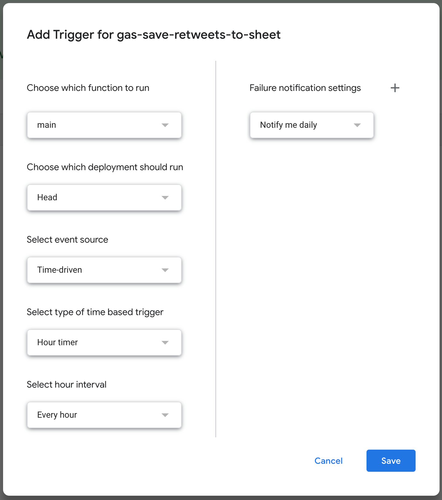

# gas-save-retweets-to-sheet

> :bird: Fetch and save retweets to Google Sheet on Google Apps Script

## Requirements

- Twitter OAuth (consumer key, consumer secret, access token, and access token secret)

## Setup

1. Create or open a Google Sheet to save retweets
1. Open Script editor (**Tools > Script editor** in the menu)
1. Copy and paste [main.js](./main.js) to a script on Script editor
1. Edit variables at the top of the script:
   - Twitter OAuth: `consumerKey`, `consumerSecret`, `accessToken`, `accessTokenSecret`
   - Target tweet ID of retweets: `tweetId`
   - Google Sheet name to save retweets: `sheetName`

## Usage

- Run `main` function (the :arrow_forward: icon or **Run > Run function > main** in the menu)
- Create a time-driven trigger to run `main` function periodically (the clock icon in the menu)
  

## How it works

1. Fetch at most 100 recent retweets of the target tweet
1. Insert new retweets among them into the top of the the Sheet (from newest to oldest)

The number of the retweets which can be fetched at one time is limited to 100 because of the Twiter API. So I recommend creating a trigger to run this script periodically.
